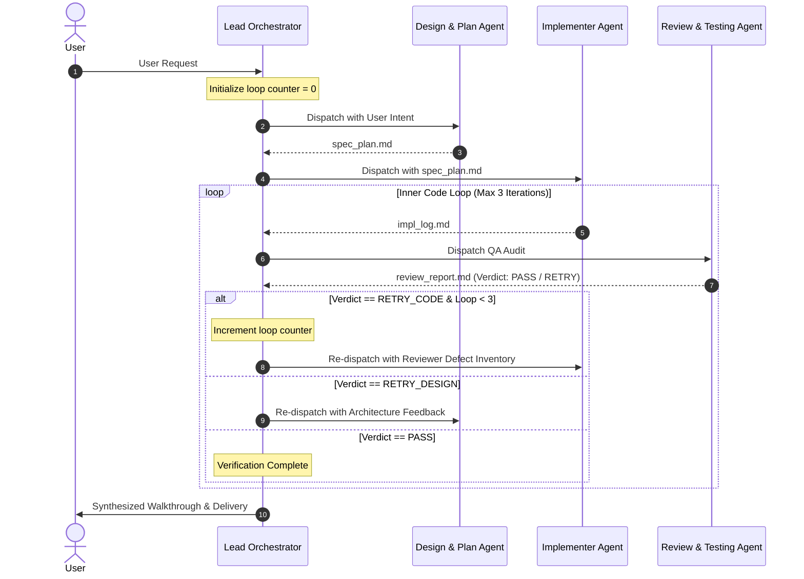

# BBDevOps Multi-Agent Orchestrator Skill

This skill operationalizes the multi-agent system with dual-loop feedback engineering for the BBDevOps repository.

## When to Use This Skill
Activate this skill whenever a non-trivial user feature, refactoring, or bug fix is requested. It guarantees structured planning, isolated implementation, and rigorous automated testing before any task is declared complete.

---

## The Orchestration Protocol

---

## Step-by-Step Execution Runbook

### Step 1: Lead Orchestrator Intake & State Initialization
1. Initialize session loop trackers:
   - `code_loop_count = 0` (Max 3)
   - `design_loop_count = 0` (Max 2)
2. Create or clean the run directory at `.agents/runs/<task-id>/`.
3. Adopt the **Lead Orchestrator** persona (`.agents/roles/orchestrator.md`).

---

### Step 2: Dispatch Design & Plan Agent
1. Transition persona to **Design & Plan Agent** (`.agents/roles/planner.md`).
2. Run read-only codebase exploration (`grep_search`, `list_dir`, `view_file`).
3. Generate the specification document at `.agents/runs/<task-id>/spec_plan.md`.
4. Ensure the plan strictly adheres to:
   - Poppins font + Phosphor Icons
   - Warm color palette (`#FAF3EA`, `#FFF8F0`, `#E07A5F`, `#D4A373`)
   - Viewport constraints (desktop Home fits in 100% viewport, mobile tab bar)

---

### Step 3: Dispatch Implementer Agent
1. Transition persona to **Implementer Agent** (`.agents/roles/implementer.md`).
2. Author components, pages, styles, or configuration according to `spec_plan.md`.
3. Write/update files using targeted edit tools (`replace_file_content` or `write_to_file`).
4. Generate the execution record at `.agents/runs/<task-id>/impl_log.md`.

---

### Step 4: Dispatch Review & Testing Agent
1. Transition persona to **Review & Testing Agent** (`.agents/roles/reviewer.md`).
2. Execute automated verification:
   - `npm run build`
   - `npm run lint` (or oxlint)
3. Audit responsive rules (375px mobile, 768px tablet, 1440px desktop) and SEO/meta tags.
4. Formulate the evaluation report at `.agents/runs/<task-id>/review_report.md` with explicit verdict:
   - `PASS`
   - `RETRY_CODE`
   - `RETRY_DESIGN`

---

### Step 5: Loop Engineering Decision Gate
1. Resume **Lead Orchestrator** persona.
2. Evaluate the verdict in `review_report.md`:
   - **Case A: Verdict is `PASS`**:
     - Finalize task deliverables.
     - Compile user-facing `walkthrough.md`.
     - Present verified results to the user.
   - **Case B: Verdict is `RETRY_CODE`**:
     - Check `code_loop_count < 3`.
     - If true: Increment `code_loop_count`, feed the defect inventory back into Step 3 (Implementer).
     - If false: Halt loop, document unresolvable errors, and notify user for manual pairing.
   - **Case C: Verdict is `RETRY_DESIGN`**:
     - Check `design_loop_count < 2`.
     - If true: Increment `design_loop_count`, feed architectural feedback back into Step 2 (Planner).
     - If false: Halt loop and notify user.
